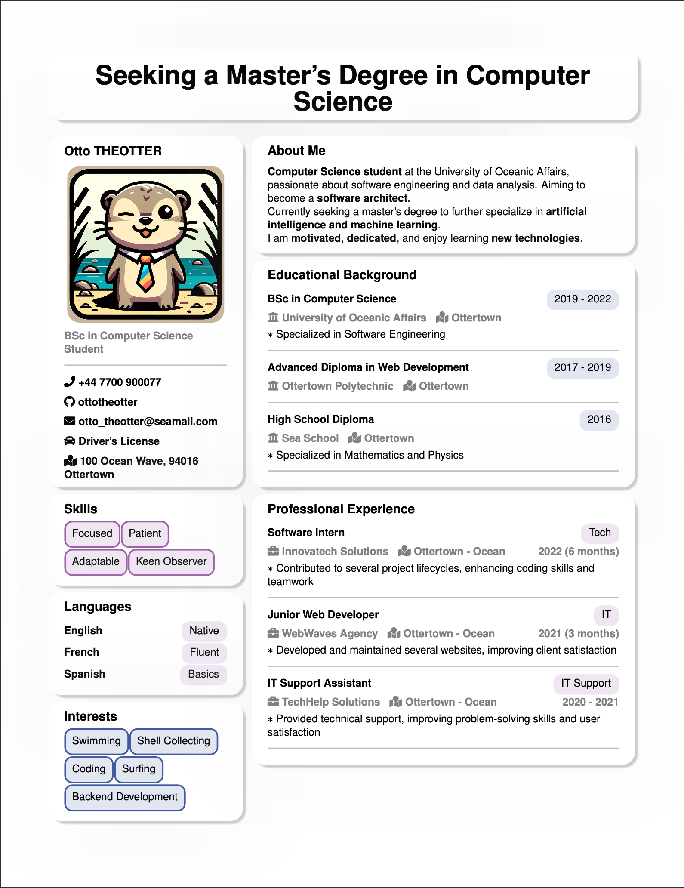

# BentoCV

BentoCV is a LaTeX package designed to simplify the creation of modern and elegant resumes with a minimalist aesthetic. Inspired by the organizational charm of Bento boxes, this package offers a streamlined two-column layout and neatly compartmentalized sections for easy customization and readability.

## Features

- **Simplified Layout:** Design resumes effortlessly with a clean two-column layout.
- **Section Compartmentalization:** Organize content into distinct sections for clarity.
- **Minimalist Aesthetic:** Adopt a modern, elegant design approach.
- **Customizable Colors:** Personalize your resume with a range of color options.
- **Seamless Integration:** Works seamlessly with LaTeX packages like Hyperref and Font Awesome.
- **Flexible Geometry Settings:** Adjust layout settings to fit your needs.
- **User-Friendly Commands:** Add content with easy-to-use LaTeX commands.
- **Bento-Inspired Design:** Features elements inspired by the organizational charm of Bento boxes.

## Getting Started

### Installation

Download the `bentocv.sty` file from this repository, or clone the repository to your local machine:

```bash
git clone git@github.com:mbido/BentoCV.git
```

### Global Installation (Optional)

To use BentoCV across all your LaTeX projects, install it globally:

1. Create a Local TeXmf Directory:
    ```bash
    mkdir -p ~/texmf/tex/latex
    ```
2. Move BentoCV:
    ```bash
    mv bentocv.sty ~/texmf/tex/latex/
    ```
3. Refresh TeX Database:
    ```bash
    texhash ~/texmf
    ```

### Usage

Include the package in your LaTeX document:

```tex
\usepackage{bentocv}
```

### Customization

Customize your resume by adjusting layout, colors, and content using BentoCV commands. Here is an example of how to change the layout:

```tex
\setlength{\sectionspacing}{10mm} % Adjust spacing between sections
```

## Example

For a comprehensive example, check out the materials provided in this repository:

- [Example LaTeX Source](example/example.tex): The source code for the example resume.
- [Example Resume PDF](example/example.pdf): A compiled version of the example resume for a more detailed view.

Below is an image preview of the example resume:




## Contributing

Contributions are welcome! Feel free to open an issue or submit a pull request with any improvements or bug fixes. Please adhere to the existing code style and add unit tests for any new or changed functionality.

## Support

For questions and support, contact [insert contact method] or join our [insert discussion platform].

## License

This project is licensed under the MIT License - see the LICENSE file for details.
